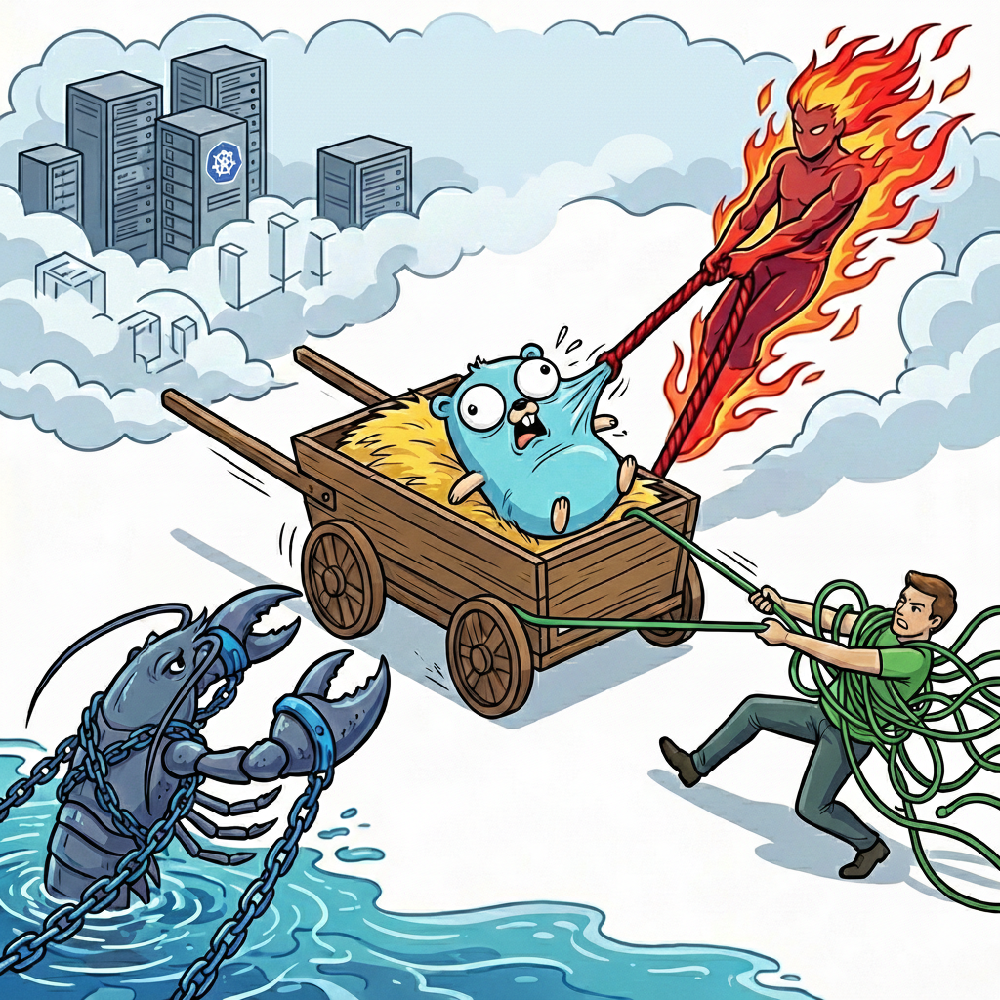

<!-- file date: 2026-02-08 · published on LinkedIn: (add link) -->

📌 Your service is throttled at 40% CPU. The problem isn't your code.

I spent 5 A/B test iterations debugging a Go ranking service using CatBoost. ~250 RPS, thousands of products per request, 500ms budget.

CPU throttling at 37-40% average utilization. Latency spiked, timeouts climbed.

❓ Natural reaction - optimize the code:

- Blob cache instead of per-field HGETALL

- Speculative parallel fetch instead of sequential

- WaitGroup + semaphore to prevent cascade cancellations

Each optimization helped. But throttling remained.

🧠 Root cause - three layers fighting over CPU:

CatBoost via CGO/OpenMP grabs all cores for short intense bursts. K8s CFS enforces CPU limits per 100ms window - 50ms burst on 4 cores = 200ms CPU time = entire quota gone. The service manages concurrency via model pools, unaware of what CFS sees.

Average CPU 40%, CFS throttling 2.4%. Dashboards say "fine" while pods are starved.

💡 The fix wasn't code - it was understanding the resource model:

- CPU limits 2000m -> 4000m for burst headroom

- Replicas 3 -> 5 to reduce per-pod load

Result: p95 243ms -> 77ms. Errors 3.69% -> <0.1%.

📊 When CGO + OpenMP + CFS meet, they create invisible conflicts. Before optimizing code, check container_cpu_cfs_throttled_periods_total.

#backend #golang #machinelearning #catboost #kubernetes #cgo #systemdesign

---

