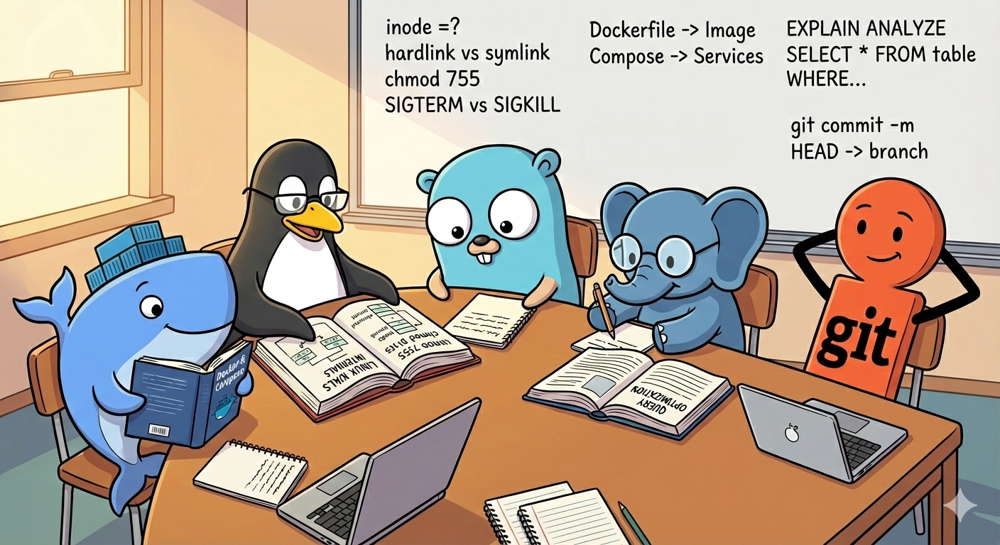

<!-- file date: 2026-02-16 · published on LinkedIn: (add link) -->

📌 Go is my main tool. But I've always wanted to understand what's happening around it.

The infrastructure, the tools that make everything work in production - I realized early on that I had only surface-level knowledge of most of them. So I started digging deeper.

Here's what I found worth revisiting:

🐧 Linux - inodes, hardlinks vs symlinks, chmod bit masks, POSIX signals (SIGTERM vs SIGKILL - which can't be caught?). Years in terminal without really understanding the filesystem beneath.

🐳 Docker - Dockerfile builds one image. Compose orchestrates many. Container shares host kernel, VM runs its own. Used daily, but couldn't clearly explain until I sat down and studied.

🔀 Git - Branch is a moving pointer to a commit. Tag is a static one. Annotated tags store metadata, lightweight don't. Simple internals that change how you think about version control.

🗄️ PostgreSQL - Query is slow, what's your first step? The sequence matters: slowlog -> EXPLAIN -> indexes -> check hardware metrics -> only then consider partitioning or replicas.

💡 Go gives me the language. But Linux, Docker, Git, databases, observability - that's the ecosystem I work in. Understanding it deeper made me more confident as a developer.

#golang #backend #linux #docker #git #postgresql

---

