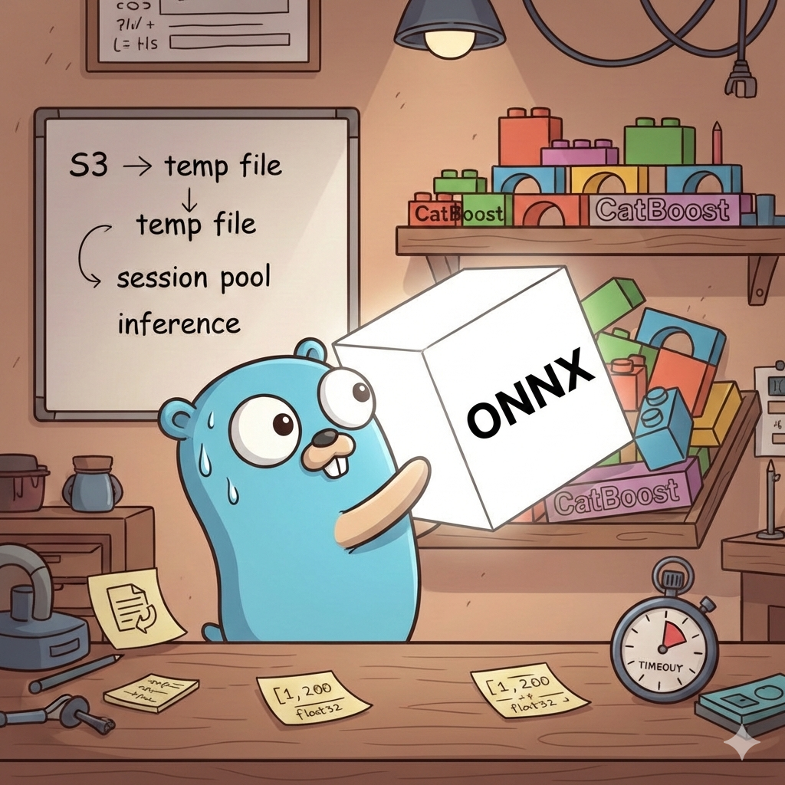

<!-- file date: 2026-02-19 · published on LinkedIn: (add link) -->

📌 I started building ONNX inference into an existing Go service. The task sounded simple. It wasn't.

The service already ran CatBoost in production with session pooling, atomic model swaps, S3 loading. Adding another ML model should've been straightforward, right?

Here's what I didn't expect:

🔧 ONNX Runtime needs a file path, not bytes. CatBoost loaded models from memory. ONNX's C API required a file on disk. So I wrote model bytes to a temp file, created a session, deleted the file. For a pool of N sessions — N+1 temp files per load.

🧠 Tensor prep is manual. CatBoost took [][]float32. ONNX expected explicitly shaped tensors with correct types. Two inputs [1, 200], output metadata cached in atomic.Value for lock-free reads.

⚡ CGo can't be cancelled via context. The C call blocked the OS thread. So inference ran in a goroutine with select-based timeout + recover() for native panics.

♻️ The session pool pattern transferred 1:1. Same atomic.Pointer swap, same refcount cleanup, same reload watcher.

💡 Clean architecture compounds — check my CatBoost post for the foundation this was built on.

#golang #backend #onnx #machinelearning #microservices #cgo

---

Gemini Banana prompt:

Cartoon illustration, clean outlines, colorful, slightly humorous, LinkedIn-professional style. A warm workshop scene. The blue Go gopher (center) stands at a workbench, looking puzzled at a large glowing ONNX cube (white with "ONNX" logo) that won't fit into a neat row of smaller colored blocks already on the shelf (labeled "CatBoost"). A friendly Python snake (yellow and blue) peeks from behind the ONNX cube, smiling as if saying "good luck with that". On the workbench: scattered tensor shapes written on sticky notes, a small temporary file icon with a recycling arrow, and a stopwatch showing a timeout. A whiteboard behind shows a simple flow diagram with arrows: "S3 → temp file → session pool → inference". Warm lighting, tinkering/building vibe, the gopher is rolling up sleeves. No text overlays except on the whiteboard and sticky notes.

---

