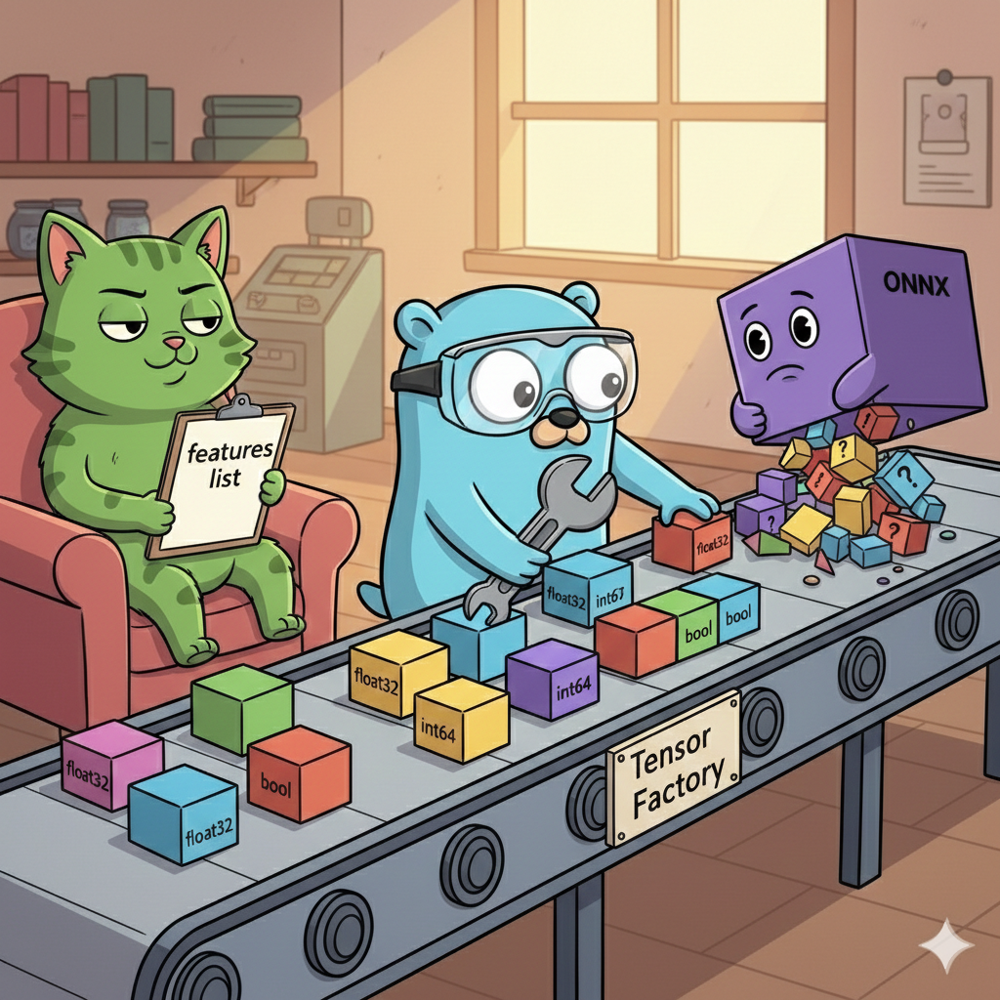

<!-- file date: 2026-02-19 · published on LinkedIn: (add link) -->

📌 CatBoost tells you what it needs. ONNX gives you raw metadata and wishes you luck.

When I integrated CatBoost into a Go ranking service, one call to GetModelUsedFeaturesNames() returned everything — feature names, order, types. The model described itself.

ONNX didn't work that way.

🧩 All I got was GetInputOutputInfo() — node names, shapes with -1 for dynamic dimensions, and data type enums. No feature descriptions, no structure hints.

🏭 So I built a tensor factory. Extract output metadata once during model load, cache in atomic.Value, reuse for every inference.

The factory resolves -1 → actual batch size, then dispatches across 11 data types via Go generics — NewEmptyTensor[float32], [int64], [bool]. Pre-allocated, type-safe, zero reflection.

🔨 Input side was manual too. SASRec expected two [1, 200] float32 tensors — padded item IDs and a binary mask. String IDs parsed to floats, history truncated or zero-padded.

♻️ CatBoost gave this for free. With ONNX, I built the equivalent from scratch — and gained full control over tensor lifecycle and cleanup.

💡 When the model can't describe itself, you build the layer that does.

#golang #backend #onnx #machinelearning #microservices #generics

---

Gemini Banana prompt:

Cartoon illustration, clean outlines, colorful, slightly humorous, LinkedIn-professional style. A workshop scene. The blue Go gopher (center) stands at a conveyor belt assembling colorful geometric blocks (labeled "float32", "int64", "bool") into neat rows of tensors. On the left side, a smug green CatBoost cat sits in an armchair holding a clipboard labeled "features list" — it already knows everything. On the right side, a purple ONNX box with a shrug emoji face has dumped a pile of unlabeled raw shapes and question marks onto the conveyor belt. The gopher wears safety goggles and holds a wrench, methodically sorting the chaos into order. A small sign on the conveyor reads "Tensor Factory". Warm lighting, building/manufacturing vibe. No text overlays except the labels on blocks and the sign.

---

