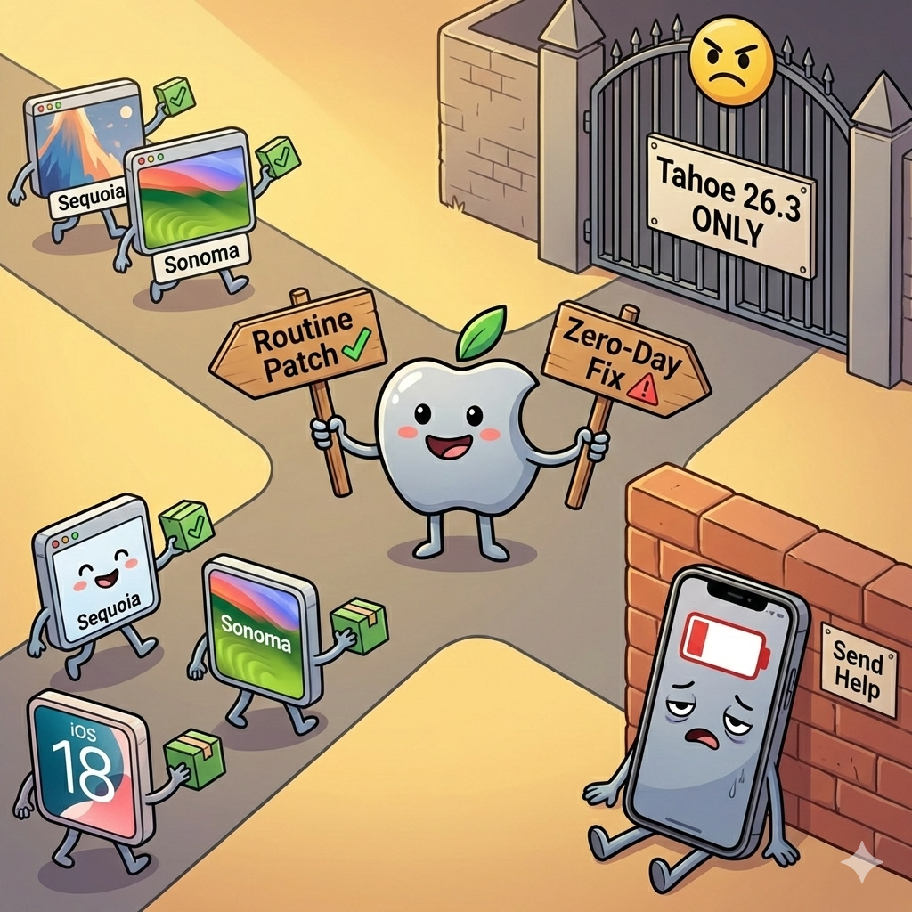

<!-- file date: 2026-02-20 · published on LinkedIn: (add link) -->

📌 Apple patched an actively exploited zero-day. To get the fix, you need the new major OS. On any device.

CVE-2026-20700: memory corruption in dyld, used in targeted attacks. Found by Google TAG. CVSS 7.8.

Fixed in iOS 26.3 and macOS Tahoe 26.3. That's it.

Sequoia 15.7.4 and Sonoma 14.8.4 shipped the same day with a bunch of patches. CVE-2026-20700 is not among them. iOS 18.7.5 shipped for XS/XR only, and also skips this fix.

So Apple's policy is pretty clear: routine patches get backported. Actively exploited zero-days don't. You want that fix, you upgrade to the new major version. Mac or iPhone, same rule; XS/XR on 18.7.5 aren't covered.

🔋 My experience: iPhone 16 Pro on Tahoe drains noticeably faster. iPad is better but still not great. I'm starting to understand people who stay on older software for as long as possible. Maybe I'm becoming a retrograde, who knows.

💡 Update for security, just know the trade‑offs. 😐 

---

Gemini Banana prompt:

Cartoon illustration, clean outlines, colorful, slightly humorous, LinkedIn-professional style. Center scene: a cartoon Apple logo character (friendly, round, with a leaf on top) stands at a crossroads holding two signs. One sign points left and reads "routine patch" with a green checkmark, the other points right and reads "zero-day fix" with a red warning triangle. On the left road: older OS versions (small label "Sequoia", "Sonoma", "iOS 18") walk along happily getting small green packages delivered. On the right road: a single gate labeled "Tahoe 26.3 only" blocks the path, with a bouncer emoji face. In the corner, a tired cartoon iPhone 16 Pro with a drooping red battery leans against a wall with a small sign "send help". Warm lighting, slightly sarcastic vibe, no text overlays except the road signs and labels.

---

