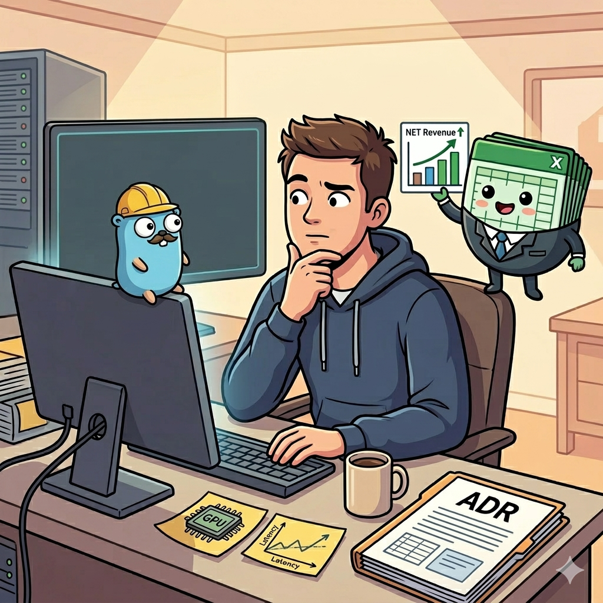

<!-- file date: 2026-03-12 · published on LinkedIn: (add link) -->

📌 I was debugging a CPU throttling issue in a ranking service. My product lead's first question wasn't technical.

It was: "What's the business effect?"

I'd traced the problem to OpenMP bursts + Kubernetes CFS - a structural incompatibility at ~40% CPU utilization. The fix required GPU infrastructure. So I drafted an ADR.

What I wasn't prepared for was the approval process.

🧠 The conversation with product and ML leads:
- T4 GPU node: ~€450/month
- Planned: 150 features per item + 2 parallel model pools - CPU wouldn't hold
- Fewer replicas post-migration = partial cost offset
- ML team's estimate: +0.5% CRB = ~€3-5M NET Revenue

Nothing moved until the numbers were on the table.

💡 Core backend teams feel far from "the business." No user research, no conversion funnels - just latency graphs and resource limits.

But every infra decision has a price. More replicas hit quota ceilings. GPU adds a monthly bill. Doing nothing means throttled inference at scale.

Even in a deeply technical role, I found myself acting like a PM: justify the cost, quantify the risk, translate infra into revenue.

📊 The line between backend engineer and engineering manager is thinner than it looks.

#backend #golang #kubernetes #machinelearning #engineering

---

