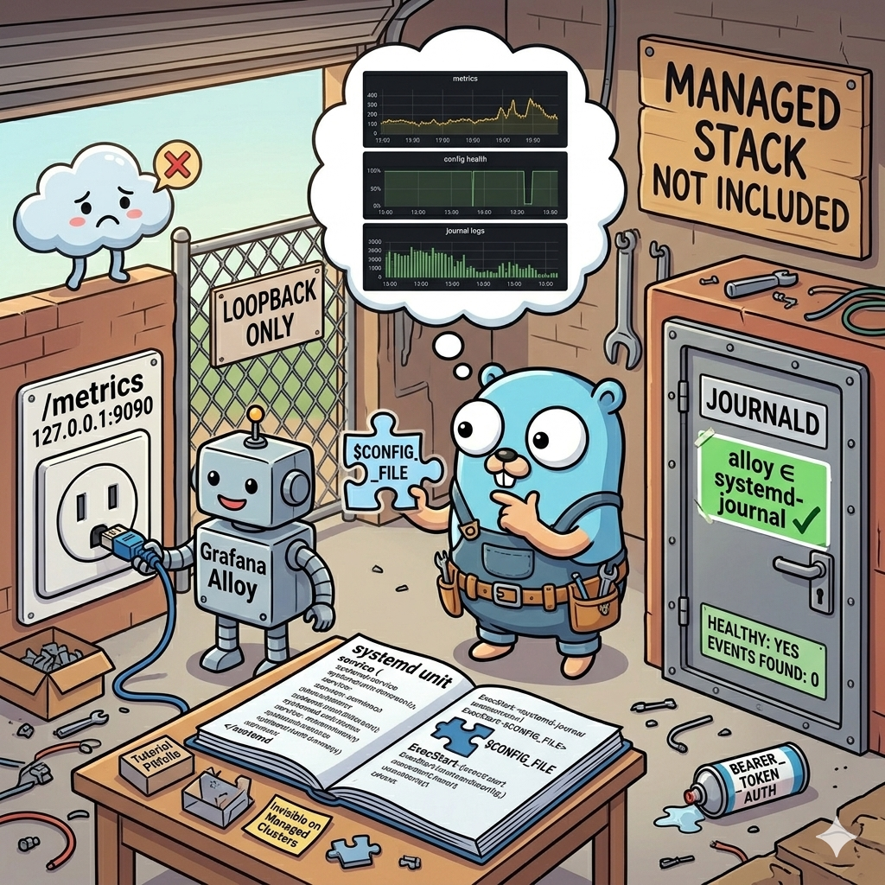

<!-- file date: 2026-05-13 · published on LinkedIn: (add link) -->

📌 Wired Prometheus + Loki into a personal Go service this week. Three pitfalls, none of them in any tutorial.

On your own deployment every layer of friction is yours to discover:

- The "bearer_token" pattern in scrape config assumes API auth is `Authorization: Bearer`. Mine isn't. Fix: a second `http.Server` on `127.0.0.1:9090`, only `/metrics`, no auth.
Local Alloy scrapes over loopback; the internet can't open the socket. Auth limits exposure one way; network reachability is cheaper.

- Dropped my env file into `/etc/default/alloy` - alloy crash-looped with `accepts 1 arg(s), received 0`. The stock systemd unit expands `$CONFIG_FILE` into ExecStart; my
replacement silently swallowed it.

- `loki.source.journal` shows "Healthy" with zero events when the `alloy` user isn't in `systemd-journal`. The first sign you're not in the group is the absence of evidence.

🧠 Every one of these is invisible on a managed cluster - someone else's Helm chart knows. On a side project you trip into each one yourself, and the shape stays with you.

💡 That's the kind of layered understanding you can't shortcut. Times being what they are, the patterns you assemble compound - and ideally eventually become things you charge
for.

#golang #observability #prometheus #grafana #backend #sideprojects

---

